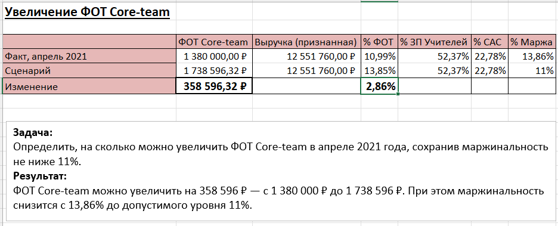
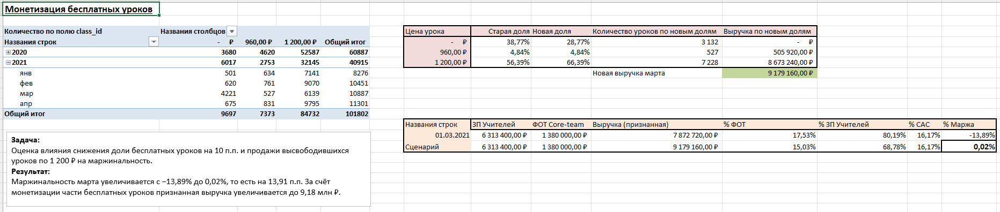
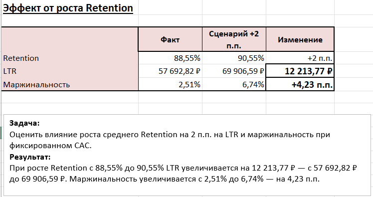

# Online School Unit Economics Analysis

## Project Overview

This project analyzes the unit economics of an online education business using Excel.

The base unit economics model was built as part of a course workshop. Based on this model, I independently completed three business scenarios focused on payroll costs, lesson monetization, and student retention.

The project demonstrates how changes in business assumptions affect revenue, LTR, and profitability.

---

## Business Metrics

The analysis includes the following metrics:

- CAC (Customer Acquisition Cost)
- Retention
- Lifetime
- LTR (Lifetime Revenue)
- Revenue
- Teacher payroll costs
- Fixed costs
- Profit margin

---

## Business Scenarios

### 1. Core Team Payroll Increase

**Objective:** Determine how much the core team payroll can be increased in April 2021 while keeping the profit margin at or above 11%.

**Result:** Core team payroll can be increased by approximately **358,596 RUB**, from **1.38M RUB to 1.74M RUB**, while maintaining an 11% profit margin.

---

### 2. Monetization of Free Lessons

**Objective:** Evaluate how the March 2021 profit margin changes if the share of free lessons is reduced by 10 percentage points and these lessons are sold for 1,200 RUB instead.

The total number of lessons remains unchanged.

**Result:** The profit margin increases from **-13.89% to 0.02%**, an improvement of **13.91 percentage points**.

---

### 3. Retention Growth

**Objective:** Evaluate the effect of increasing average Retention by 2 percentage points while keeping CAC fixed.

The scenario follows the relationship:

`Retention → Lifetime → LTR → Unit Economics → Profit Margin`

**Result:**

- LTR increases from **57,692.82 RUB to 69,906.59 RUB**
- LTR growth: **12,213.77 RUB**
- Profit margin increases from **2.51% to 6.74%**
- Profit margin growth: **4.23 percentage points**

---

## Excel Skills Demonstrated

- Pivot tables
- Data aggregation
- Cross-sheet calculations
- Excel formulas
- Business metric calculations
- Unit economics analysis
- Scenario analysis
- Percentage and percentage-point calculations
- Revenue and cost structure analysis

---

## Workbook Structure

The workbook contains:

- `CAC's` — acquisition cost analysis and CAC calculations
- `Свод` — consolidated unit economics calculations
- `Задача 1. Найм` — payroll scenario
- `Задача 2. Бесплатные уроки` — free lesson monetization scenario
- `Задача 3. Эффект от Retention` — retention scenario and results

The first two worksheets contain the base analytical model developed during the course workshop. The three business scenarios were completed independently based on this model.

---

## Key Takeaway

The analysis demonstrates how changes in operational and product metrics can be translated into financial outcomes. In particular, the retention scenario shows the relationship between customer retention, lifetime revenue, cost structure, and profitability.

---

## Author

**Daria Sinitsina**  
Junior Data Analyst
