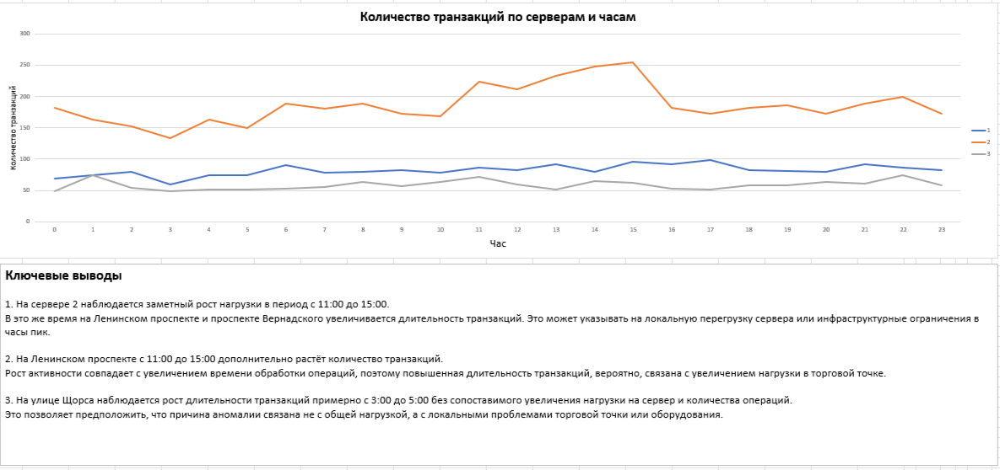
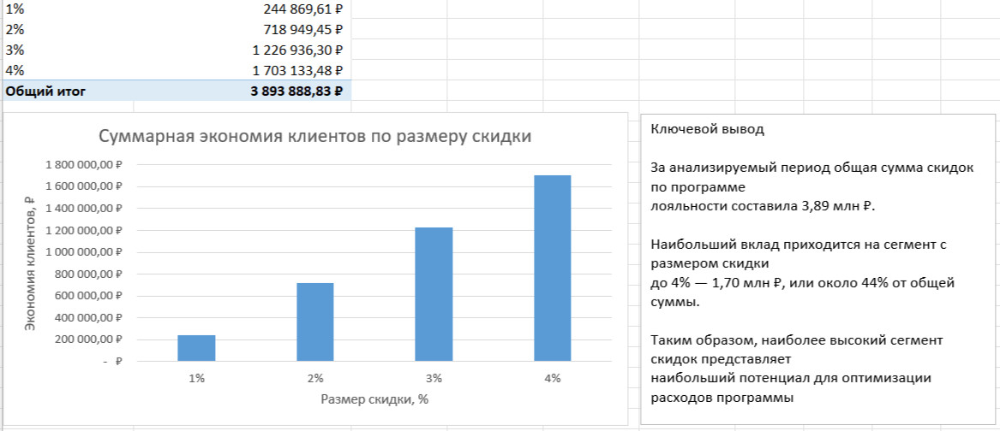
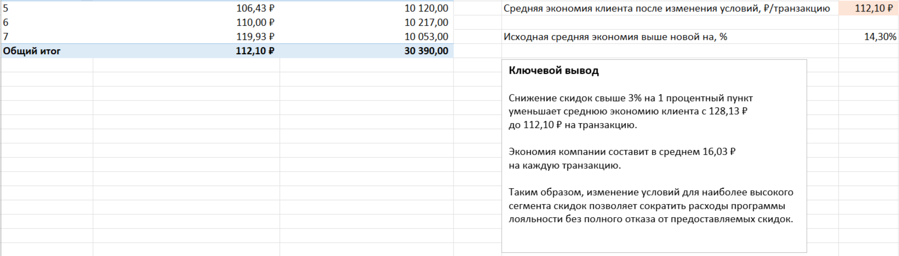

# Payment Operations Analysis

## Project Overview

This project analyzes payment transaction data in Microsoft Excel with a focus on operational performance and loyalty program economics.

The analysis includes investigation of transaction processing anomalies, segmentation by servers and trading points, loyalty discount analysis, and scenario modeling to estimate the financial impact of changing discount rules.

## Business Tasks

* Investigate increased transaction processing time and identify possible causes.
* Analyze transaction dynamics by hour, trading point, and server.
* Evaluate the financial impact of the loyalty program.
* Segment loyalty discounts and assess their contribution to total customer savings.
* Estimate potential company savings from reducing discounts above 3% by 1 percentage point.

## Dataset

The dataset contains transaction-level information, including:

* transaction ID;
* payment amount;
* transaction duration;
* transaction timestamp;
* server ID;
* trading point;
* payment system;
* loyalty discount.

## Analysis Workflow

1. Prepared and enriched the transaction data for analysis.
2. Created calculated fields for time-based segmentation.
3. Built pivot tables to analyze transaction volume and processing duration.
4. Investigated anomalies by server and trading point.
5. Evaluated loyalty program costs per transaction.
6. Segmented discounts into ranges and analyzed total customer savings.
7. Modeled a scenario with reduced discounts above 3%.

## Excel Techniques

* Pivot Tables
* Pivot Charts
* Calculated Columns
* VLOOKUP
* IF / AND
* HOUR
* SUMPRODUCT
* ROUNDUP
* Percentage calculations
* Scenario analysis
* Data visualization

## Key Insights

* A significant increase in transaction volume was observed on Server 2 between 11:00 and 15:00, coinciding with increased transaction duration at several trading points.
* Some transaction duration anomalies were not accompanied by higher server load, suggesting possible local infrastructure or equipment issues.
* Total customer savings from the loyalty program amounted to approximately 3.89 million RUB over the analyzed period.
* The highest discount segment contributed approximately 1.70 million RUB, or about 44% of total loyalty savings.
* Reducing discounts above 3% by 1 percentage point lowers average customer savings from 128.13 RUB to 112.10 RUB per transaction.
* The modeled change would save the company approximately 16.03 RUB per transaction.

## Project Files

### Analysis

* `analysis/payment_analysis_part1.xlsx` — transaction performance analysis and investigation of September 1 anomalies.
* `analysis/payment_analysis_part2.xlsx` — loyalty program economics, discount segmentation, and scenario analysis.

### Screenshots

#### Transaction Performance Analysis

#### Loyalty Discount Segmentation

#### Loyalty Scenario Analysis

## Author

**Daria Sinitsyna**  
Junior Data Analyst  
Telegram: @sinitcynadaria
